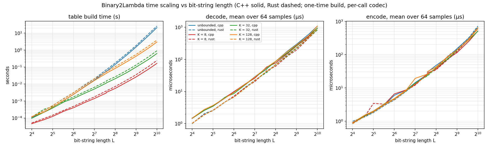
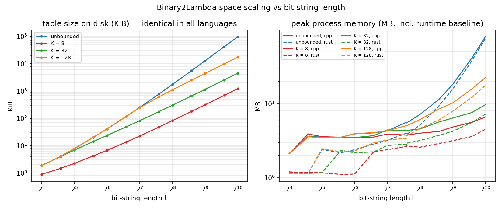
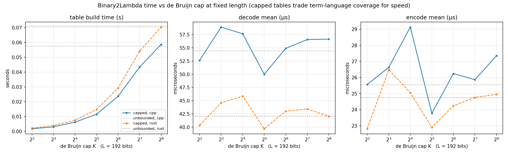
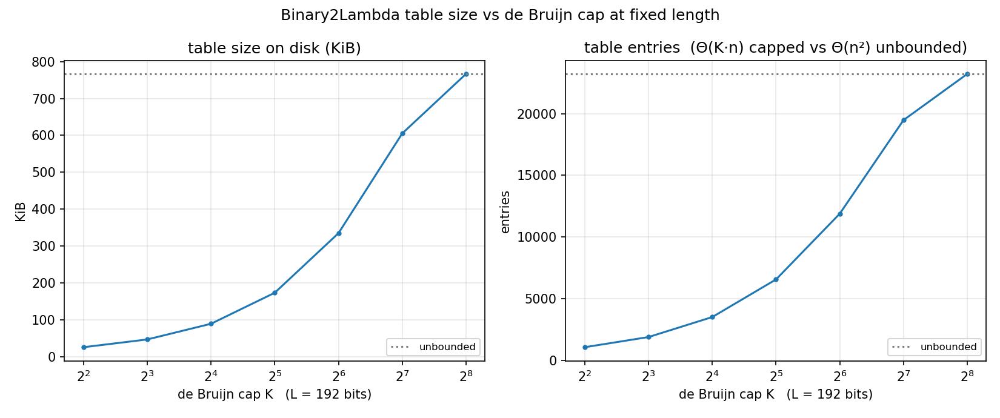
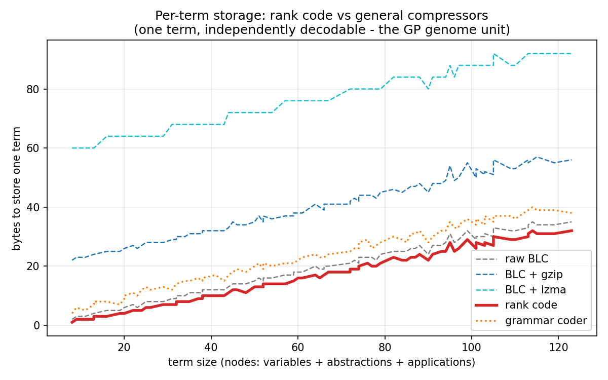
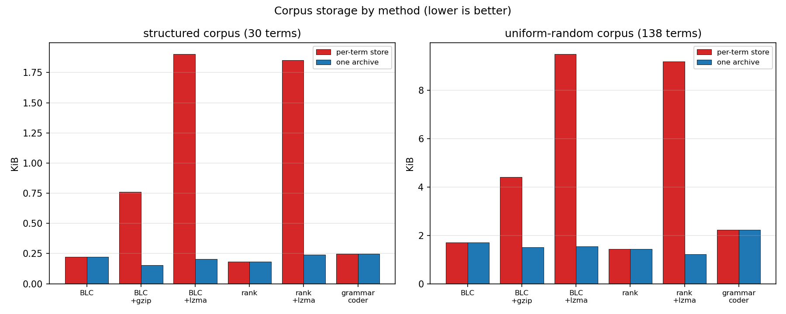
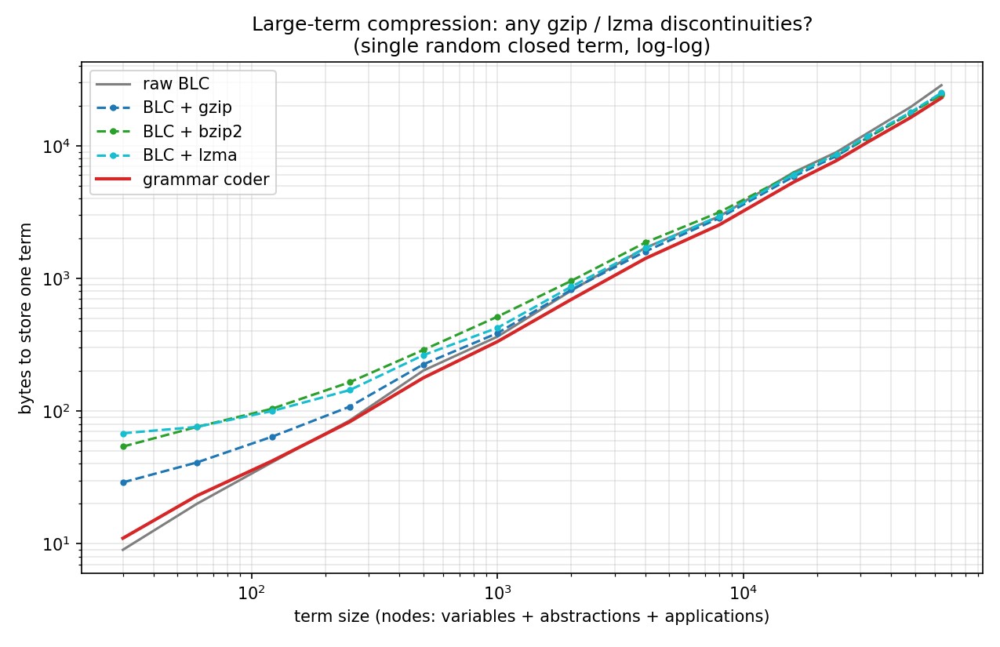

# Binary2Lambda

**A total bijection between binary strings and closed untyped lambda terms.**

Every binary string — including the empty string — denotes exactly one closed
λ-term, and every closed λ-term has exactly one binary string. (Equivalently,
a bijection with the natural numbers: under bijective binary numeration — the
leading 1 is implicit — a string `s` and the number `int("1" + s, 2) − 1` are
interchangeable, so Binary2Lambda is also Nat2Lambda. Binary strings are the
primary view because decode, bits to term, is the direction
genetic-programming workloads consume.)

```
ε   ->  λ1          00  ->  λλλ1        000 ->  λλλλ1
0   ->  λλ1         01  ->  λ1 1        001 ->  λλ1 1
1   ->  λλ2         10  ->  λλλ2        010 ->  λ1 (λ1)
                    11  ->  λλλ3        ...
```

One specification, four self-contained single-file implementations —
**Python**, **C++**, **Rust**, **Wolfram Language** — cross-validated byte
for byte (800 shared test vectors, identical table files, exhaustive
enumeration checks). The theory, complexity derivations, design rationale
and literature are in [NOTES.md](NOTES.md).

Typical uses: genetic programming and program-space search (every mutation
of every bit vector is a valid program), exact uniform sampling of closed
terms, gap-free enumeration, and canonical Gödel-style numbering with
random access in both directions.

**New here?** [docs/API.md](docs/API.md) is the programmer reference: how to
load the library in each language, the full API, and worked examples. The
theory and design rationale (with literature) are in [NOTES.md](NOTES.md). To
read the implementation itself, start with `python/lambda_bijection.py` (the
reference; its module docstring states the full specification), and
`python3 exploration/jump_table_demo.py` traces both directions through one
worked size class.

**Glossary.** *de Bruijn index* — a variable named by a number: how many
λ's out you count to reach its binder (so names are unneeded). *BLC size* —
a term's bit length in Tromp's binary lambda calculus: `|var i|=i+1`,
`|λb|=|b|+2`, `|f a|=|f|+|a|+2`; the yardstick the bijection orders terms by.
*rank / unrank* — term→index and index→term within the enumeration. *cap K* —
an optional bound on de Bruijn indices that shrinks the tables (see
Stipulations).

## Prerequisites

- **Python** ≥ 3.9, standard library only for the bijection and compression;
  **matplotlib** is needed *only* to regenerate the plots.
- **C++**: any C++17 compiler — GCC, Clang or MSVC — on Windows, Linux or
  macOS (the bignum needs only a 64-bit integer type; no `__int128` required).
- **Rust**: any recent `rustc` (developed on 1.90), no crates.
- **Wolfram Language** ≥ 13.0 (for `Tree`), via the Front End or
  WolframScript.
- Runtimes: each self-test takes seconds to ~a minute; regenerating the
  plots re-runs the whole benchmark sweep and takes a few minutes.

## How it works, in one paragraph

Closed terms are enumerated canonically: by size, then `Var < Lam < App`
within a size class. A string `s` is read as the integer
`N = int("1" + s, 2) − 1` (the leading 1 is implicit, so all 2^L strings of
every length are distinct), and N indexes the enumeration. Both directions
are driven by one counting table `T(n, m)` — the number of terms of size n
with free indices ≤ m — built incrementally by a Catalan-style recurrence.
Decoding walks the grammar, using counts to skip whole subclasses at once
(counting, *not* enumeration: a 200-bit string decodes in microseconds, not
the ~10⁶⁰ steps of enumerate-to-index). Encoding reads the same offsets back
without any searching. See [NOTES.md](NOTES.md) for why any such bijection
must take this shape, and what the alternatives cost.

## Quick start

### Python (reference implementation)

```python
# run from the python/ directory (or add it to PYTHONPATH); no dependencies
from lambda_bijection import Table, decode, encode, show_term

table = Table()                      # unbounded de Bruijn indices
term = decode(table, "010001100")    # every 0/1 string is valid
print(show_term(term))               # (λ1 (λλ1)) (λ1)
assert encode(table, term) == "010001100"

table.save("table.lamtab")              # persist the expensive artifact
table = Table.load("table.lamtab")      # ... and continue incrementally
```

Self-test: `python3 python/lambda_bijection.py` (validates counts against
exhaustive enumeration, 12,000 round trips, cap semantics in every
direction, save/load with corruption detection, and error paths). The
compression layer self-tests with `python3 python/lambda_compress.py`.

### C++

CMake (configures the standard level and optimisation flags, runs the tests):

```
cmake -B build -DCMAKE_BUILD_TYPE=Release
cmake --build build
ctest --test-dir build --output-on-failure
./build/lambda_bijection_cpp                   # self-test and demo
```

Or a single compiler command — it is one dependency-free file:

```
g++ -std=c++17 -O2 -o cpp/lambda_bijection_cpp cpp/lambda_bijection.cpp
cpp/lambda_bijection_cpp                        # self-test and demo
cpp/lambda_bijection_cpp --vectors              # decode test vectors
cpp/lambda_bijection_cpp --compress-vectors     # compression test vectors
cpp/lambda_bijection_cpp --fuzz blobs.txt       # decode hex blobs (see verify/)
cpp/lambda_bijection_cpp --save-table t.lamtab     # write a sample table (cap 5)
cpp/lambda_bijection_cpp --load-table t.lamtab     # load and verify a table
cpp/lambda_bijection_cpp --bench inf 256        # one benchmark block (CSV)
```

Dependency-free: arbitrary precision comes from the small `BigNat` class in
the file. For heavy workloads swap it for GMP's `mpz_class` — `BigNat`'s
operations are a strict subset of mpz semantics, so the substitution is
mechanical and removes the main constant-factor cost.

### Rust

```
cargo run  --release --manifest-path rust/Cargo.toml      # self-test + demo
cargo test --manifest-path rust/Cargo.toml                # self-test as a test
rustc -O -o rust/lambda_bijection_rs rust/lambda_bijection.rs   # or one command
rust/lambda_bijection_rs                                  # same flags as C++
```

Also dependency-free (its own `BigNat`); maps directly onto `num-bigint` or
`rug` if you want a crate-backed bignum.

### Wolfram Language

`wolfram/LambdaBinarization.wl` is a notebook-style package: open it in the
Front End to read it as a documented notebook (text cells explain every
function), or load it with `Get` and call the API:

```wl
Get["/abs/path/to/wolfram/LambdaBinarization.wl"]   (* Needs["LambdaBinarization`"] once on $Path *)
DecodeBitString["010001100"]            (* a closed lambda term *)
LambdaTermForm[%]                       (* renders (λ1 (λλ1)) (λ1) *)
LambdaTermTree[DecodeBitString["01"]]   (* expression tree, λ / @ nodes *)
SaveLambdaTable["table.lamtab", 64]     (* shared binary (.wxf, .mx also work) *)
LoadLambdaTable["table.lamtab"]         (* load it back *)
LambdaBijectionSelfTest[]               (* association of checks, all True *)
```

Run it headlessly with WolframScript:
`wolframscript -file driver.wl`, where `driver.wl` does `Get[...]` then
`Print[LambdaBijectionSelfTest[]]`. On WSL the Windows `wolframscript.exe`
cannot read POSIX paths — point `Get` at a `\\wsl.localhost\…` UNC path (or
copy the `.wl` to a Windows-readable directory first). `LambdaBijectionSelfTest[]`
re-verifies the embedded constants that are cross-validated against the
other three implementations, plus round trips, cap agreement, non-closed
rejection, and a save/load cycle (it does not regenerate the 800 vectors at
run time).

## The interface (uniform across languages)

| concept | Python | C++ | Rust | Wolfram Language |
|---|---|---|---|---|
| terms | `Var/Lam/App` | `var()/lam()/app()` | `Term::Var/Lam/App` | `LambdaVar/LambdaAbs/LambdaApp` |
| table | `Table(index_cap)` | `Table(cap)` | `Table::new(cap)` | memoised `TermCount` |
| grow (length axis) | `table.extend(n)` | `table.extend(n)` | `table.extend(n)` | auto / `BuildLambdaTable` |
| change cap | `table.set_index_cap(k)` | `setIndexCap` | `set_index_cap` | auto (keys shared) |
| decode (number→λ) | `decode(table, bits)` | `decode` | `decode` | `DecodeBitString` |
| encode (λ→number) | `encode(table, term)` | `encode` | `encode` | `EncodeLambdaTerm` |
| print term / bits | `show_term`, `show_bits` | `showTerm`, `showBits` | `show_term`, `show_bits` | `LambdaTermForm`, `BitStringForm`, `LambdaTermTree` |
| cap discovery | `max_de_bruijn_index` | `maxDeBruijnIndex` | `max_de_bruijn_index` | `MaxDeBruijnIndex` |
| persistence | `save`/`load` | `saveToFile`/`loadFromFile` | `save_to_file`/`load_from_file` | `SaveLambdaTable`/`LoadLambdaTable` |

## Stipulations — what must be fixed up front, and what doesn't

1. **The de Bruijn cap is part of the bijection's identity.** A table built
   with a finite cap K enumerates closed terms whose indices never exceed
   K, and **each cap value (unbounded included) is a different bijection**
   — treat the cap like a codec version: fix it before encoding anything,
   and use the same value on both sides forever. Capped and unbounded
   bijections agree on all terms of size ≤ K+1, so small terms are safe
   across caps, but do not rely on that for general data.
2. **You never *need* a cap or a length bound for correctness.** A string
   of length L decodes to a term of size ≈ 1.03·L, and a size-n term cannot
   contain an index above n−1 — so the bit length already implies an index
   bound, and the unbounded bijection requires no decisions at all. The
   cap exists purely as a memory/speed optimization (Θ(K·n) instead of
   Θ(n²) table entries) at the price of excluding deep-index terms
   (exponentially rare in practice). When you only know terms, not bounds:
   measure with `max_de_bruijn_index`, then pick any table with cap ≥ that.
3. **Resources scale with the longest string you process**, so for
   capacity planning you do want to know your maximum bit length — see the
   plots below for exactly what a given (L, K) costs in build time, disk
   and RAM.

## Two usage modes: prebuilt vs incremental

The incremental machinery is optional. If your experiment has a known
bound, **prebuild once and treat the table as a static artifact**: call
`table.extend(n)` (C++/Rust: `extend`; WL: `BuildLambdaTable`) up to the
size you need — or just `Table.load(...)` a saved file — and no growth
happens at run time as long as inputs stay within the bound. If an input
exceeds the bound, encode/decode grow the table transparently
(append-only; existing entries and the map itself never change — the
tables of all bounds are prefixes of one infinite array). The incremental
path matters when bounds are unknown or grow over a project's life;
everyone else can ignore it after the initial build.

## Tables on disk

One portable binary format (`.lamtab`: a 7-byte magic, the cap, the built
size, then per-size rows of length-prefixed big-endian counts, then an
FNV-1a-64 trailer), written and read by all four ports interchangeably — the
files are byte-identical across languages, save streams the body so memory
stays flat, and load verifies the checksum, rejecting any corruption or
truncation. The Wolfram port reads and writes the same `.lamtab` and also
offers native `.wxf` and `.mx` for the same table. Sizes: see the plots below;
the unbounded table reaches ~43 MiB on disk at L = 1024, the K = 32 table
2.1 MiB. (Format details: [docs/API.md](docs/API.md) §4.)

## Performance

Benchmarks are run by the C++ and Rust binaries (`--bench`, one process per
measurement so the peak-RSS reading is honest); Python only renders the
plots. `python3 python/plot_performance.py` **re-runs the entire benchmark
sweep** (both binaries over ~70 blocks, several minutes; needs matplotlib
and both binaries built at `cpp/lambda_bijection_cpp` and
`rust/lambda_bijection_rs`) and then writes the PNGs and
[plots/bench_results.csv](plots/bench_results.csv). The Python reference
follows the same curves with ~50× larger constants
(`python/profile_scaling.py`).









Summary (C++ unless noted): at L = 64, build ~3 ms, decode 10 µs, encode
5 µs. At L = 1024 unbounded: build 21 s once, decode 1.1 ms, encode
0.6 ms, table 43 MiB on disk, ~80 MB peak RSS. Same length with cap K = 32:
build 0.6 s, table 2.1 MiB, ~9 MB peak RSS. Rust tracks C++ closely —
decode a touch faster, build ~40 % slower (allocator-heavy bignums), peak
RSS comparable. Table build is one-time and incremental: extending a saved
table to a longer length costs only the marginal rows.

## Compression

The bijection's rank code (`encode(table, term)`, the term's index in the
canonical enumeration, in binary) is itself a compressor. Per closed lambda
term it produces fewer bytes than general-purpose compressors, for two
reasons:

1. The rank code is the Shannon-optimal code for the uniform distribution
   over closed terms: on a uniformly random term, no code is shorter.
   General-purpose compressors do not model the grammar, so they leave Tromp
   BLC's ~2.7 % redundancy and add a per-stream container.
2. Storing one term, gzip/bzip2/lzma each add 20–90 bytes of framing; the
   rank code adds none.

Measured over a 138-term diverse random population and a 30-term structured
set (`python/compression_benchmark.py`, standard library only — gzip, bzip2,
lzma). Bytes to store one term, independently decodable, as a fraction of
raw BLC:

| method | uniform-random | structured |
|---|---|---|
| raw BLC | 100 % | 100 % |
| BLC + gzip | 259 % | 343 % |
| BLC + lzma | 557 % | 858 % |
| rank code | 84 % | 83 % |

Per term the rank code is 3–10× smaller than these general-purpose
compressors and smaller than raw BLC. In the whole-archive regime (serialize
every term, compress once, no random access), general-purpose compressors
amortize their container and match cross-term repetition; there the random
corpus gives rank-code + gzip 70 % vs BLC + gzip 88 %, and the structured
corpus gives BLC + gzip 70 % vs rank code 83 %.





Algorithmic information theory: every bijection between `{0,1}*` and closed
terms has the same multiset of codeword lengths (one ε, two of length 1, …,
2^L of length L), hence the same mean length over all terms. No bijection
has a smaller mean than the rank code; the rank code is the bijection that
assigns the smallest terms the shortest codes. BLC is not a bijection — valid
closed BLC programs are an exponentially-vanishing fraction of strings
(0.084 % at length 20) — which is its redundancy and why the rank code is
smaller. A bijection that is smaller than the rank code on a *specific*
non-uniform source exists: reorder the enumeration so that source's frequent
terms get shorter codes (a probability-sorted rank code), shorter on the
source and longer elsewhere. See [NOTES.md](NOTES.md) §8–§9.

A structure-aware coder is also provided (`lambda_compress`, in Python, C++
and Rust, byte-compatible; WL has no compressor): an adaptive renormalizing
range coder over the grammar, linear in the node count in both directions. It
consumes a term, not a bitstream, so it cannot be applied to BLC bytes. On
small random terms it pays an adaptive-startup cost and a few bytes of flush
tail, so the rank code is smaller; as terms grow its model converges and its
output is smaller than raw BLC and than gzip/bzip2/lzma at every size into
the tens of thousands of nodes (`python/compression_large.py`; the
general-purpose compressors show no discontinuities, settling near 85 % of
BLC):



So the rank code is the smaller codec for small/medium terms and the grammar
coder for large terms, each smaller than the general-purpose compressors per
term. An exploratory subterm-sharing layer (`python/compress_research.py`)
adds grammar-native repeat references: on the structured corpus it cuts the
grammar coder from 112 % to 95 % of raw BLC per term — below the LZ-family
compressors, though still above the rank code on these small terms, with the
constant per-term overhead amortizing on larger repetitive terms.

## Repository layout

```
python/     lambda_bijection.py (reference), lambda_compress.py,
            compression_benchmark.py, compression_large.py,
            compress_research.py, profile_scaling.py, plot_performance.py,
            check_cross_tables.py, gen_wl_constants.py
cpp/        lambda_bijection.cpp        (single file, no dependencies,
                                         includes the compression layer)
rust/       lambda_bijection.rs         (single file, no dependencies,
                                         includes the compression layer)
wolfram/    LambdaBinarization.wl       (notebook-style package)
plots/      rendered benchmarks + bench_results.csv
verify/     cross-language differential fuzz harness (verify/README.md)
docs/       API.md (programmer reference)
exploration/ research scripts from the design sessions (jump tables,
            O(1) lookup regime, incremental-extension measurements)
CMakeLists.txt, rust/Cargo.toml   build files (see Quick start)
.github/    CI: builds and tests the Python, C++ and Rust ports
NOTES.md    theory, complexity, design rationale, literature
CONTRIBUTING.md   build/test all four ports; the byte-identity invariant
```

See [docs/API.md](docs/API.md) for the full programmer API and
[CONTRIBUTING.md](CONTRIBUTING.md) for the build-and-test workflow.

## Validation

- Counts validated against exhaustive BLC enumeration of all bit strings
  (sizes ≤ 14, four different caps) in Python, C++ and Rust independently,
  including the open-term contexts (`count(n, m)` for m > 0).
- 800 decode vectors byte-identical across Python, C++, Rust and WL.
- Table files (`.lamtab`) byte-identical and cross-loadable between all four
  ports (verified Wolfram ↔ Python byte for byte); checksum corruption (a
  flipped byte, a truncated file, a bad magic) is rejected by every loader.
- Compression output byte-identical across Python, C++ and Rust on the
  shared vector set; round trips on all exhaustively enumerated small
  terms plus structured and uniform large terms; malformed compressed input
  stays well-behaved (clean error, never a crash, hang, or overflow), in
  time linear in the node count.
- Cross-language differential fuzz (`verify/`): thousands of random and
  adversarial byte blobs decode identically in all three implementations,
  and every `compress` output round-trips to the original term.
- Error paths tested in every implementation: non-0/1 bits, non-closed or
  over-cap terms on encode, and corrupt table files.
- Round trips in both directions in every implementation, both axes of
  incrementality exercised (length extension; cap change in every direction
  with row reuse).

## License

MIT © 2026 Richard Assar. See [LICENSE](LICENSE).
